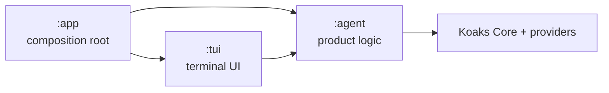
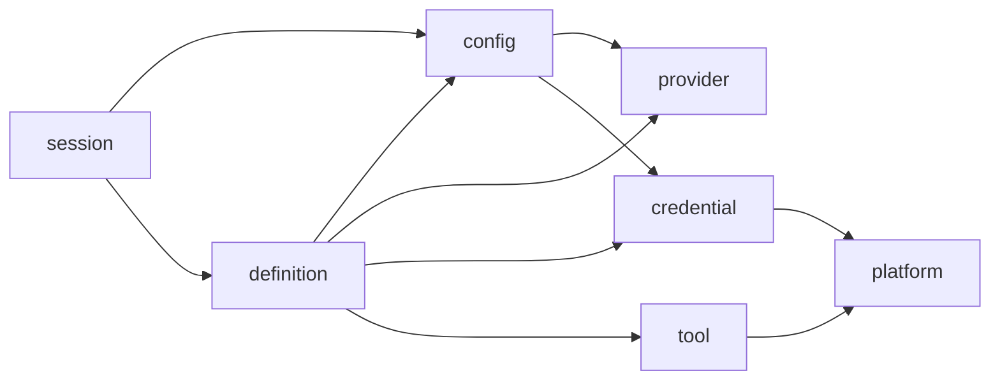

# Architecture

`koaks-agent` is a thin product layer over Koaks. Runtime scheduling, conversations,
memory, child-agent lifecycle, events, tools and approval semantics remain owned by
Koaks; this repository assembles product configuration, local capabilities and the
terminal experience.

## Module ownership

- `:app` (`org.koaks.agent.cli.*`) is the only composition root. It parses argv,
  formats process-level failures, owns fatal handling and trace files, and creates
  the runtime, policies, memory provider, stable thread and terminal frontend.
- `:agent` (`org.koaks.agent.*`) owns product configuration, credentials, provider
  bindings, Agent definitions, sessions, tools, policies and native product platform
  adapters. It does not depend on either frontend module.
- `:tui` (`org.koaks.agent.tui.*`) owns terminal input, output, rendering, commands,
  approval interaction and reducer state. It depends on `:agent` contracts and never
  owns product contracts itself.

The session package belongs to `:agent`. `ChatSession`, `SessionCommand` and
`SessionSnapshot` are product-facing contracts; `:tui` only consumes them. Trace is an
application composition concern: `TerminalTrace` describes terminal lifecycle events,
`AgentListener` describes Koaks lifecycle events, and `:app` combines both in
`CliTrace`.

All modules use Kotlin explicit API. Public declarations are limited to cross-module
contracts; implementations remain `internal` where possible.

## Package dependency DAG

The inverse edges `tool -> definition`, `provider -> AgentConfig`, and
`config -> session` are forbidden. Subagent construction lives in `tool.delegate`,
so tool code does not need to import the definition package.

## Runtime and session lifecycle

1. `:app` resolves static configuration without writing to disk.
2. The composition root creates one `ThreadId`, one `MemoryProvider`, one
   `WorkspaceAccessPolicy`, one `ProcessPolicy`, and one `AgentRuntime`.
3. `AgentChatSession` owns the thread and memory provider for its lifetime. Provider,
   model or reasoning commands replace only the effective Agent definition; they do
   not replace the thread or memory policy.
4. `AgentDefinitionFactory` accepts `EffectiveAgentSettings`, not the full file
   configuration. Provider bindings accept `ModelRuntimeSettings` and therefore do
   not depend on `AgentConfig`.
5. `SubagentTool` uses Koaks structured child execution. Main and subagent tool lists
   are concrete `Tool` instances; approval names are derived from
   `Tool.hasSideEffects` on those same instances.

The current seams intentionally stop here. This repository does not yet define a
workspace model, persistent session store, branch model, snapshot format or migration
layer.

## Security boundaries

- Configuration may contain a `CredentialRef`, or an explicit `api_key` for
  local-only setups. `SessionSnapshot` exposes only `CredentialSummary`; `/status`
  never receives an API key or the full `AgentConfig`.
- Workspace paths are normalized and resolved to their final filesystem target before
  access. Windows junctions and Apple symbolic links cannot escape the injected root.
- Shell commands run with an environment allowlist, a deadline and bounded captured
  output. Credentials are not inherited automatically.
- Every Agent that registers a tool with `hasSideEffects = true` must install Koaks
  `HumanApproval` derived from that Agent's actual tool list. This applies equally to
  the main Agent and subagents.
- The shell policy is not an OS sandbox. The UI and documentation must not describe it
  as one.

## Build conventions and versions

`build-logic` is the single source for the Kotlin, serialization, Spotless and ktlint
versions. `gradle.properties` is the single source for the Koaks version. A version
catalog is intentionally not introduced because the main build and included
`build-logic` build would need a second sharing mechanism for only a few versions.

Gradle 9.6 reports the Gradle 10 `archives configuration` deprecation while applying
Kotlin Multiplatform 2.2.20 to `:agent`. This repository does not declare or mutate an
`archives` configuration; the warning originates in the Kotlin Gradle plugin's native
publication setup. It must be rechecked when upgrading Kotlin, and the Kotlin plugin
must be upgraded before moving this build to Gradle 10.

## Test policy

Tests protect contracts whose regression would cross a module or security boundary:
configuration schema/precedence, explicit initialization, credential availability,
provider registration, session commands and secret-free snapshots, stable thread and
memory policies, main/subagent approval, path escape prevention, process termination,
trace composition, reducer lifecycle and command semantics. ANSI cursor sequences,
cosmetic formatting and private implementation steps are tested only where they
protect terminal behavior.
