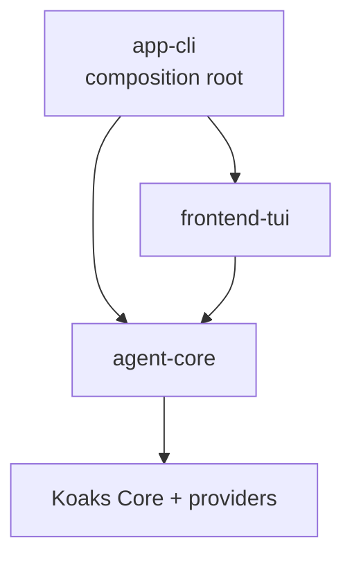

# Architecture

`koaks-agent` is a thin product layer over Koaks. Runtime scheduling, conversations,
memory, child-agent lifecycle, events, tools and approval semantics remain owned by
Koaks; this repository only assembles product configuration, local capabilities and
the terminal experience.

## Module ownership

- `app-cli` is the only composition root. It creates one `AgentRuntime`, owns its
  lifetime, binds one stable `ThreadId` to the session, and replaces an agent
  definition only between turns.
- `agent-core` owns configuration, Agent definitions, Provider bindings, credentials,
  local tools, workspace/process policies, and native platform implementations. These
  boundaries are packages inside one product module rather than separate Gradle
  projects. Provider-native options stay inside each binding instead of being
  flattened into a false common model.
- `frontend-tui` owns terminal state, command parsing, the reducer and event
  presentation. It talks to the runtime only through `ChatSessionPort`.

`agent-core` uses the packages `config`, `definition`, `provider`, `credential`,
`tool`, and `platform`. Runtime/session code remains in `app-cli`; terminal-specific
native code remains in `frontend-tui`.

All modules use Kotlin explicit API. Public declarations are limited to cross-module
contracts; implementation details remain `internal`.

## Runtime and session lifecycle

1. `app-cli` resolves the file configuration without writing to disk.
2. `AgentDefinitionFactory` resolves the selected credential at construction time and
   builds immutable main/subagent definitions.
3. `CliChatSession` installs the definition into its single `AgentRuntime` and streams
   a turn with the same `ThreadId` for the whole conversation.
4. Slash commands update only `SessionPreferences`. The current definition is closed
   and rebuilt on the next turn, when no stream is active.
5. `SubagentTool` uses `spawnChild(CAPTURE, Ephemeral)`, so cancellation, quotas and
   child lifetime remain structured by Koaks.

## Security boundaries

- Configuration may contain `CredentialRef`, or an explicit `api_key` for local-only
  setups. Credential references resolve from an environment variable, Windows
  Credential Manager, or macOS Keychain; `/status` never prints the key value.
- Workspace paths are normalized and resolved to their final filesystem target before
  access. Windows junctions and Apple symbolic links cannot escape the configured
  root.
- Shell commands run with an environment allowlist, a deadline and bounded captured
  output. Credentials are not inherited automatically.
- Shell and write operations are side effects and require Koaks `HumanApproval` in
  the TUI.
- The shell policy is not an OS sandbox. The UI and documentation must not describe it
  as one.

## Test policy

Tests protect contracts whose regression would cross a module or security boundary:
configuration schema/precedence, explicit initialization, credential availability,
provider registration, runtime/subagent behavior, path escape prevention, process
termination, reducer lifecycle and command semantics. ANSI cursor sequences, cosmetic
formatting, trivial data classes and private implementation steps are intentionally
not exhaustively tested.
